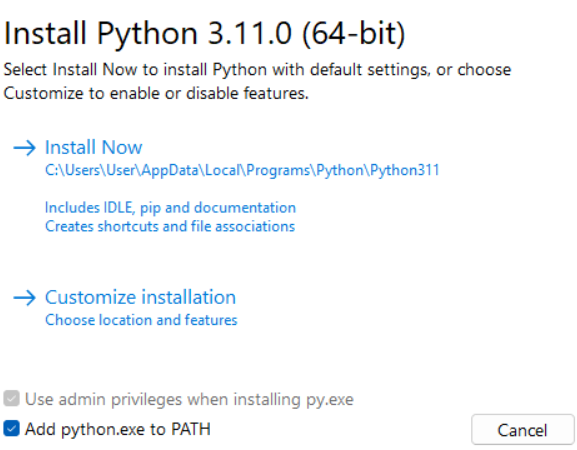

# YtDownloader

- [Installation](#Installation)

## Installation

- [Linux](#Linux)

- [Windows](#Windows)

### Linux

Requirements:

|Tool  |Command|
|--------|-----------|
|Python3|`sudo apt update && sudo apt full-upgrade -y && sudo apt |install python3 -y`|
|pip3|`sudo apt update && sudo apt full-upgrade -y && sudo apt install python3-pip -y`|

Package:

| Package    | Command |
| ---------- | --------------- |
| youtube-dl | `pip3 install --upgrade youtube-dl` |
| loguru     | `pip3 install --upgrade loguru` |

Run:

```bash
python3 main.py
```

### Windows

Requirements:

| Tool             | Link                                                  |
| ---------------- | ----------------------------------------------------- |
| Python3.8+ & pip | [Link to download](https://www.python.org/downloads/) |

Please tick this option before continue install python:



After tick `Add python.exe to PATH` press `Install Now` or `Customize installation`

> **NOTE: If you chose `Customize installation` make sure you have install pip**

Package:

| Package    | Command                            |
| ---------- | ---------------------------------- |
| youtube-dl | `pip install --upgrade youtube-dl` |
| loguru     | `pip install --upgrade loguru`     |

Run:

```bash
python main.py
```

or

```bash
py main.py
```


